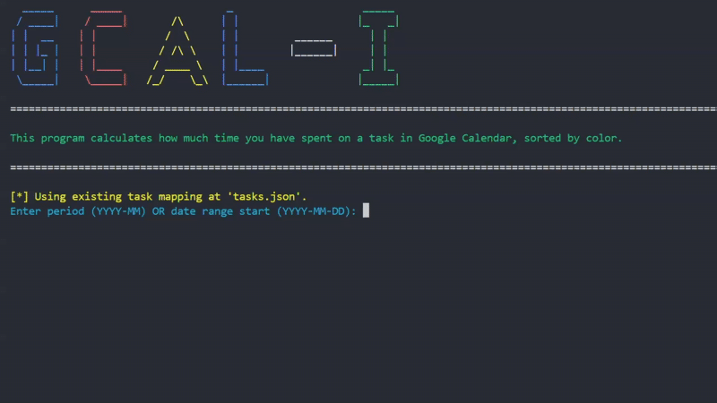

# 
GCAL - I: Google Calendar Insights

Summarize the time spent on each color-coded task in your Google Calendar.

It will prompt you to:
- Map each color to a specific task
- Specify either a custom date range or a month and year (e.g., 2024-09) to define the time period

The script will then calculate and display the total time spent on each task, along with the average time per day, week, month, and year over the selected period.

If you want to change the task mapping, delete or modify tasks.json (the code will prompt you to create a new one if it doesn't exist in your directory).

You will need to first turn on the Google Calendar API here (https://developers.google.com/calendar/quickstart/python) and save credentials.json to your working directory.

## Inspiration
- https://www.youtube.com/watch?v=sbhQNZVxcPc&t=151s
- https://github.com/mcb/GoogleCalendarAnalytics 

## API
- https://developers.google.com/calendar/concepts
- https://developers.google.com/resources/api-libraries/documentation/calendar/v3/python/latest/index.html
